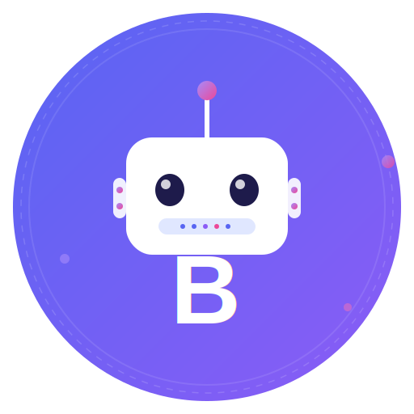

<p align="center">
  
</p>

<h1 align="center">Botaaa</h1>
<p align="center"><strong>Full-Stack Discord Bot Workspace</strong></p>

<p align="center">
  
  
  
  
  
</p>

---

## Overview

This workspace hosts **two production Discord bots** that run concurrently via `launcher.py`:

| Bot | Directory | Purpose | Stack |
|-----|-----------|---------|-------|
| **Miss Kim** | `Bot/bot1/` | Conversational AI with image generation, vision, mood system | discord.py, OpenAI-compat LLMs (Cerebras, Groq, Ollama), Cloudflare AI |
| **Lookism HXCC** | `Bot/bot2/` | Gacha game bot: cards, battles, market, trades, gangs, wars, tournaments | discord.py, SQLite + JSON, PIL, Supabase sync |

**Stats:** ~95+ source files · 127 regression tests · 80+ slash commands · 26 card definitions · 4 AI providers · 3 data stores

---

## Quick Start

```bash
git clone https://github.com/Xollonox/Botaaa.git
cd Botaaa
pip install -r requirements.txt
python launcher.py
```

### Environment Variables

| Variable | Required | Used By |
|----------|:--------:|---------|
| `DISCORD_TOKEN` | Yes | Both bots |
| `CEREBRAS_API_KEY` | No | bot1 |
| `GROQ_API_KEY` | No | bot1 |
| `OLLAMA_API_KEY` | No | bot1 (up to 5 keys) |
| `CLOUDFLARE_API_TOKEN` | No | bot1 |
| `SUPABASE_URL` | No | bot2 |
| `SUPABASE_SERVICE_ROLE_KEY` | No | bot2 |

See `.env.example` files in each bot directory for the full list.

---

## Architecture

```
Botaaa/
│
├── launcher.py                   # Process supervisor
├── requirements.txt
│
├── Bot/
│   ├── bot1/                     # Miss Kim — Conversational AI
│   │   ├── main.py               # Bot bootstrap
│   │   ├── config.py             # Env-based config
│   │   ├── commands.py           # Slash + prefix commands
│   │   ├── events.py             # Message listeners, auto-reply
│   │   ├── memory.py             # JSON per-user/channel memory
│   │   ├── persona.py            # Persona and mood system
│   │   ├── image.py              # Image gen + vision
│   │   ├── llm.py                # Multi-provider LLM with failover
│   │   └── tests/                # Regression tests
│   │
│   └── bot2/                     # Lookism HXCC — Game Bot
│       ├── main.py               # LookismBot bootstrap (32 cogs)
│       ├── bot/
│       │   ├── config.py
│       │   ├── data/             # Storage (JSON, SQLite, Supabase)
│       │   ├── services/         # Battle, market, trade logic
│       │   ├── features/         # 32 slash-command cogs
│       │   └── utils/            # 25 utility modules
│       └── tests/                # 17 test files, 127 tests
│
├── assets/                       # Logo and branding
└── docs/                         # Full documentation
```

---

## Bot1: Miss Kim

Conversational AI that roleplays as Yeonu Kim from the Lookism universe.

**Capabilities:**
- **Chat** — Natural conversation with memory, mood, and persona
- **Image Generation** — Cloudflare Flux + Pollinations backends
- **Vision** — Image analysis via Groq/Ollama vision models
- **Auto-Reply** — Keyword triggers, mention replies, DM handling

**AI Provider Chain:** Ollama → Qwen → Cerebras → Groq (automatic failover, 35-60s timeouts)

**Commands:** `/ask`, `/imagine`, `/pollo`, `/vision`, `/perchance`, `/mood`, `/language`, `/stats`, `/reset_memory`, `!kim`, `!purge`, `!say`

---

## Bot2: Lookism HXCC

Full-featured gacha card game bot with 80+ slash commands.

**Core Loop:** Register → Get packs → Open packs → Build squad → Battle → Earn rewards → Progress through seasons, achievements, leaderboards

**Feature Categories:**

| Category | Features |
|----------|----------|
| **Battle** | Ranked PvP, CPU battles, friendly duels, stamina system, 7-step damage pipeline, 6-type matchup system |
| **Economy** | Coins, premium gems, hourly/daily/weekly/monthly rewards, 10 pack types |
| **Market** | P2P marketplace with configurable fees, quick-sell, store listings |
| **Trades** | P2P card trading with rarity validation, trade offers board |
| **Social** | Gangs, alliances, gang wars with queue/battle/record system |
| **Progression** | Season pass (15 tiers), XP tournaments, achievements, 4 leaderboard types |
| **Squad** | Squad management, defensive setup, weapon equipping, keystone system |
| **Admin** | Visual card editor, owner economy controls, emoji customizer, server settings |

**Storage:** Dual JSON + SQLite architecture with atomic writes and Supabase sync for web integration.

---

## Testing

```bash
# Run all tests
cd Bot/bot1 && pytest -q
cd Bot/bot2 && pytest -q

# Focused suites
cd Bot/bot2
pytest -q tests/test_battle_engine.py
pytest -q tests/test_storage.py tests/test_race_conditions.py
pytest -q tests/test_trade_lifecycle.py
```

127 tests across 17 test files covering battle damage formulas, typing matchups, storage race conditions, SQLite migrations, trade lifecycle, and more.

---

## Dependencies

```
discord.py               # Bot framework
openai==1.37.1           # LLM API client
Pillow>=10.0.0           # Image processing
aiohttp==3.10.10         # Async HTTP
httpx==0.27.2            # HTTP client
pydantic==1.10.15        # Data validation
python-dotenv>=1.0.0     # .env loading
```

---

## Documentation

| File | Description |
|------|-------------|
| [`docs/BOT1_ARCHITECTURE.md`](docs/BOT1_ARCHITECTURE.md) | Bot1 architecture, AI provider chain, memory system, image pipeline |
| [`docs/BOT2_ARCHITECTURE.md`](docs/BOT2_ARCHITECTURE.md) | Bot2 architecture, extension loading, event flow, storage layer |
| [`docs/BATTLE_SYSTEM.md`](docs/BATTLE_SYSTEM.md) | Full battle damage pipeline, stamina, types, defense, ELO |
| [`docs/DATA_FLOW.md`](docs/DATA_FLOW.md) | Data flow through JSON + SQLite dual storage |
| [`docs/DEPLOYMENT.md`](docs/DEPLOYMENT.md) | Production deployment guide |
| [`docs/SECURITY.md`](docs/SECURITY.md) | Security audit and rotation guide |
| [`docs/ECONOMY_SYSTEM.md`](docs/ECONOMY_SYSTEM.md) | Economy, rewards, packs, market, trades |
| [`docs/API_INTEGRATION.md`](docs/API_INTEGRATION.md) | External API integrations |
| [`docs/DATABASE_SCHEMA.md`](docs/DATABASE_SCHEMA.md) | Data structure documentation |
| [`docs/COMMAND_REFERENCE.md`](docs/COMMAND_REFERENCE.md) | All commands for both bots |
| [`docs/CONTRIBUTING.md`](docs/CONTRIBUTING.md) | Contribution guidelines |

---

## License

MIT — see [LICENSE](LICENSE) for details.

---

<p align="center">
  <sub>Built with discord.py · Powered by Cerebras, Groq, Ollama, Cloudflare</sub>
</p>
